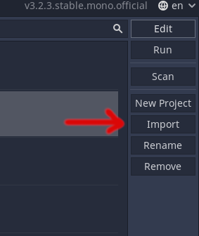
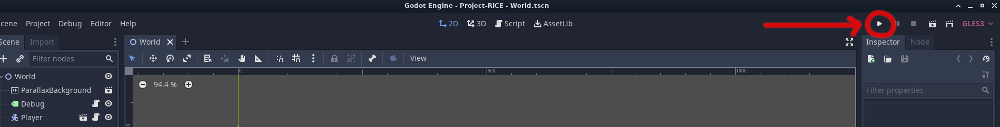
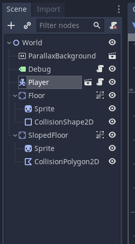
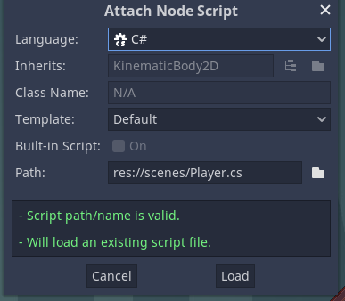

# Project-RICE - temporary project name
  A game made in Gd
  
# Running
1. Get the game engine from https://godotengine.org/download/. For C# support, choose the Mono version, then install <a href="https://visualstudio.microsoft.com/downloads/?q=build+tools">MSBuild</a> or <a href="https://www.mono-project.com/download/stable/">Mono-sdk</a> if you don't have at least one of them already.
2. Start Godot and import the project.  

3. Press F5 to run the game from the editor. Or press play in the Scene Menu.  
  

*The default configuration uses .gd. If you prefer C#, update the scripts to use their C# counterparts.*
# Using C#  
1. Right-click the nodes in the Scene-tree.   
  

2. Select Attach Script. 
3. Click the Language dropdown. Select C#.
4. The path should automatically update. Click Load.  

  
